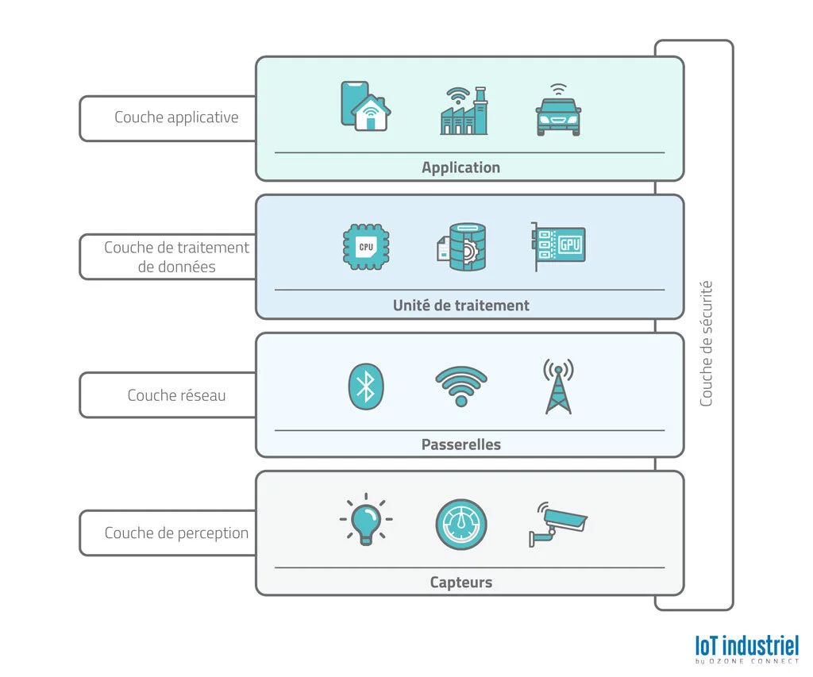

# La domotique et maisons connectées

### [Introduction]()
La domotique c'est l’ensemble des techniques qui visent à intégrer à l’habitat tous les automatismes en matière de sécurité, de gestion de l’énergie, de communication. De manière générale, toutes les applications d’un logement peuvent être pilotées de manière automatique et ainsi rentrer dans le cadre de la « maison connectée ». 

### [Use cases de la domotique](images/functions.jpg)

Pour comprendre un petit peut plus à quoi sert la domotique qui désigne l'ensemble des technologies permettant de contrôler et d'automatiser les différents équipements d'une maison, elle offre de nombreux use cases et bénéfices:
- Gestion de l'énergie : Réguler la consommation d'énergie en optimisant le chauffage, la climatisation, l'éclairage et les appareils électroménagers.
- Sécurité : Assurer la sécurité de la maison en permettant de contrôler à distance les différents équipements de surveillance, les alarmes, les détecteurs de fumée et les verrous de porte.
- Confort et bien-être : Contribuer à améliorer le confort et le bien-être des occupants de la maison en offrant une ambiance lumineuse et sonore adaptée, une température optimale et un air sain grâce à la régulation de la ventilation.
- Assistance aux personnes âgées ou handicapées : Faciliter la vie des personnes âgées ou handicapées en leur offrant des équipements de contrôle à commande vocale ou par télécommande.
- Divertissement : Créer des systèmes de divertissement tels que des cinémas maison, des systèmes de son et des écrans de projection.

En somme, la domotique offre des applications multiples et peut améliorer la qualité de vie des occupants d'une maison tout en offrant une meilleure efficacité énergétique et en renforçant la sécurité de la maison.
  
 

### [Avantage & inconvénients]()

#### Avantages
- Confort et commodité : Automatiser de nombreuses tâches dans la maison.
- Efficacité énergétique : En automatisant la gestion de l'énergie.
- Sécurité : La domotique offre des systèmes de sécurité sophistiqués qui peuvent protéger la maison contre les intrusions, les incendies et autres dangers.
- Accessibilité : La domotique peut faciliter l'accessibilité pour les personnes âgées et les personnes handicapées en offrant des commandes à distance et des systèmes de surveillance.
  
#### Inconvénients
- Coût élevé
- Complexité 
- Dépendance technologique
- Vie privée

### [Comprendre l'architecture technique d'un objet connecté](images/architecture-iot.png)
  

L'architecture technique des objets connectés de la domotique peut varier selon les types d'équipements et les fabricants, mais généralement elle comprend les éléments suivants :

- Capteurs et actionneurs : Les capteurs détectent les conditions ou les événements et les actionneurs agissent sur l'environnement en réponse aux informations fournies par les capteurs.
- Réseau de communication : Les objets connectés de la domotique communiquent entre eux et avec d'autres dispositifs de la maison via un réseau de communication.
- Passerelle (gateway) : La passerelle connecte les objets connectés de la domotique au réseau de communication.
- Système de gestion : Le système de gestion permet de contrôler et de surveiller les équipements de la domotique.
- Cloud : Certains objets connectés de la domotique peuvent être connectés à des services cloud pour permettre le stockage des données collectées et un contrôle à distance.

### [aspect sécurité : Comment utiliser un objet connecté sans se faire pirater ?]()

Tout ce qui est connecté à Internet peut potentiellement être piraté. Qu’il s’agisse d’une caméra de surveillance, d’un thermostat ou d’une prise électrique, dès qu’il est connecté, un objet présente le risque de servir un jour de point d’entrée à une cyberattaque.

#### Comment le piratage d'un objet connecté est effectué ?: 

- Attaques par force brute : Les attaquants peuvent tenter de deviner le mot de passe de l'objet connecté par force brute en testant une multitude de combinaisons jusqu'à trouver la bonne.
- Exploitation de vulnérabilités : Les objets connectés peuvent contenir des vulnérabilités de sécurité qui peuvent être exploitées par les attaquants pour prendre le contrôle de l'objet connecté.
- Phishing : Les attaquants peuvent utiliser des techniques de phishing pour tromper l'utilisateur et obtenir l'accès à l'objet connecté. Par exemple, ils peuvent envoyer des e-mails ou des messages contenant des liens malveillants qui, une fois cliqués, permettent à l'attaquant de prendre le contrôle de l'objet connecté.
- Attaques par déni de service (DDoS) : Les attaquants peuvent utiliser des objets connectés compromis pour lancer des attaques par déni de service, qui visent à saturer les serveurs cibles en les inondant de trafic, les rendant inaccessibles pour les utilisateurs légitimes.

Il est important de noter que la plupart des piratages d'objets connectés peuvent être évités en prenant des mesures simples telles que :

- vérifier que l’objet ne permet pas à n’importe qui de s’y connecter sans utiliser un mot de passe ou  un bouton d’accès physique. Les objets fonctionnant via la fonction Bluetooth sont plus facilement piratables ;
- changer le paramétrage par défaut de l’objet (mot de passe, code PIN, etc.) ;
- sécuriser le réseau WIFI à l’aide d’un mot de passe ;
- désactiver le partage automatique des données ;
- s’assurer de la possibilité d’accéder aux données et de pouvoir les supprimer ;
- effectuer régulièrement les mises à jour des logiciels ;
- éteindre l’objet quand il n’est pas utilisé.

### [Evolutions dans le domaine de la domotique]()

#### Croissance du marché

Le marché de la maison intelligente est en pleine croissance, avec une prévision de chiffre d'affaires mondial de 88 milliards d'euros cette année, atteignant 150 milliards d'euros d'ici 2025. Les équipements domotiques connectés permettent le contrôle et la gestion de diverses fonctions dans un logement et le divertissement. Le marché américain est le plus développé avec plus de la moitié des ménages équipés, tandis que la pénétration est plus faible en Europe, bien que les pays du nord soient plus avancés que ceux du sud. La France devrait atteindre plus de 25 % de ménages équipés d'ici 2024.

### [Acteurs clés de la domotique]()

Il existe de nombreux acteurs clés dans le domaine de la domotique et des maisons connectées:

- Amazon : le géant de la vente en ligne a lancé sa gamme d'enceintes connectées Alexa et a acquis plusieurs entreprises, dont Ring, pour renforcer sa présence sur le marché de la domotique.
- Google : le géant de la recherche en ligne a lancé son assistant vocal Google Home et a acquis la société Nest pour renforcer sa gamme de produits de domotique.
- Apple : la société américaine propose son assistant vocal Siri, ainsi que des produits de domotique tels que l'Apple HomePod et l'Apple TV.
- Samsung : le géant sud-coréen propose des produits de domotique tels que les enceintes connectées Galaxy Home et les appareils SmartThings pour contrôler différents aspects de la maison.

### [Multimodal Conditional Image Synthesis with Product-of-Experts GANs](https://deepimagination.cc/PoE-GAN/)

Utilisation d'un réseau de neurone du type GAN ("Generative Adversarial Networks") pour la génération de paysages photoréalistes.

### [Photorealistic Material Editing Through Direct Image Manipulation ](https://users.cg.tuwien.ac.at/zsolnai/gfx/photorealistic-material-editing/)
Génération de materiaux, à partir d'image de référence. Habituellement ce travail doit être fait par un artiste ce qui peut lui prendre un temps important.

## Image
Cette partie se concentre sur les méthodes de rendu, et plus particulièrement sur le transport de lumière.

### [NVIDIA RTX Technology](https://developer.nvidia.com/rtx/ray-tracing)
Ensemble de technologies utilisées par NVIDIA pour permettre l'utilisation du raytracing en temps réel

### [NVIDIA Ampere Architecture](https://developer.nvidia.com/nvidia-ampere) 
Hardware dédié au raytracing permettant d'utiliser cette technologie en temps réel.

### [NVIDIA Deep Learning Super Sampling (DLSS)](https://developer.nvidia.com/rtx/ray-tracing/dlss) 
Réseau de neuronne profond permettant le debruitage des images à la sortie du raytracer.

### [Metropolys light transport](https://graphics.stanford.edu/papers/metro/)

Technique avancée de de rendu photoréaliste remarquablement efficace pur trouver les régions les plus claires de la scène en construisant un nombre plus important de rayons qui visent ces régions. 
Amélioration de la méthode d'intégration par Monte Carlo habituellement en usage pour le path tracing. 

### [Deep Scattering](http://simon-kallweit.me/deepscattering/)

Utilisation d'un réseau de neurone pour le rendu photoréaliste de milieux participatifs. Par exemple le rendu du nuage.

